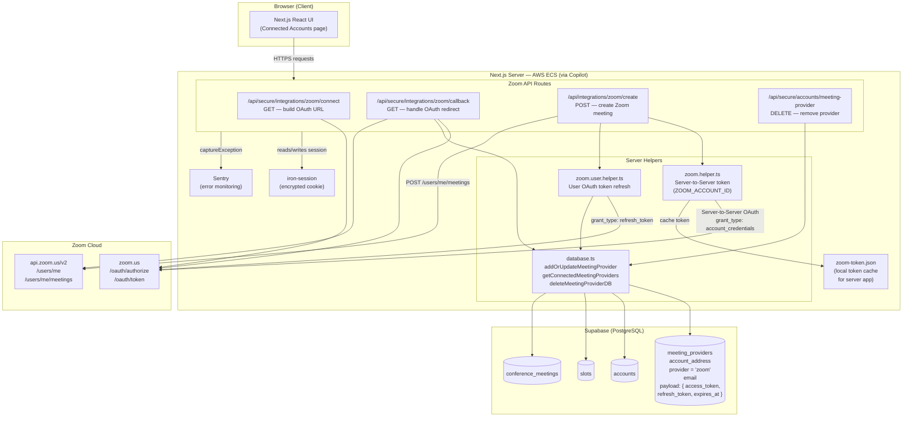
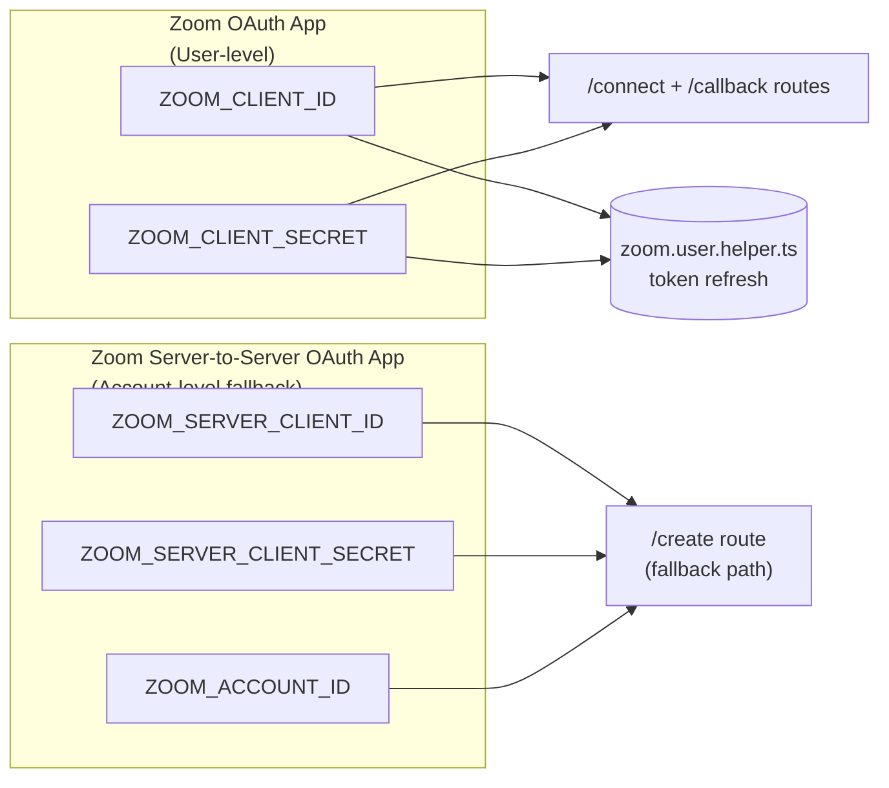
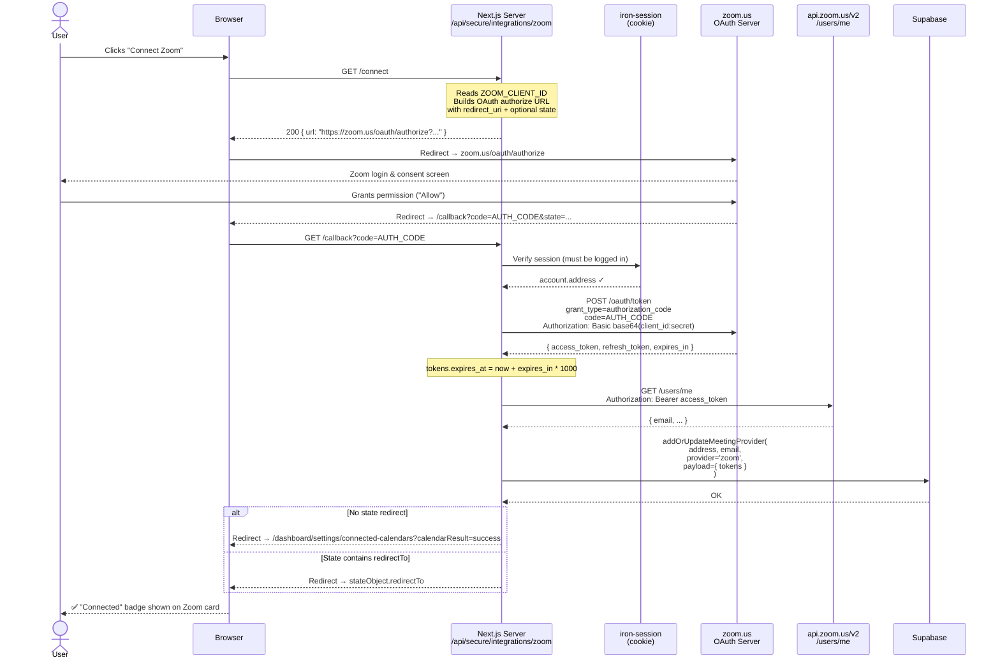
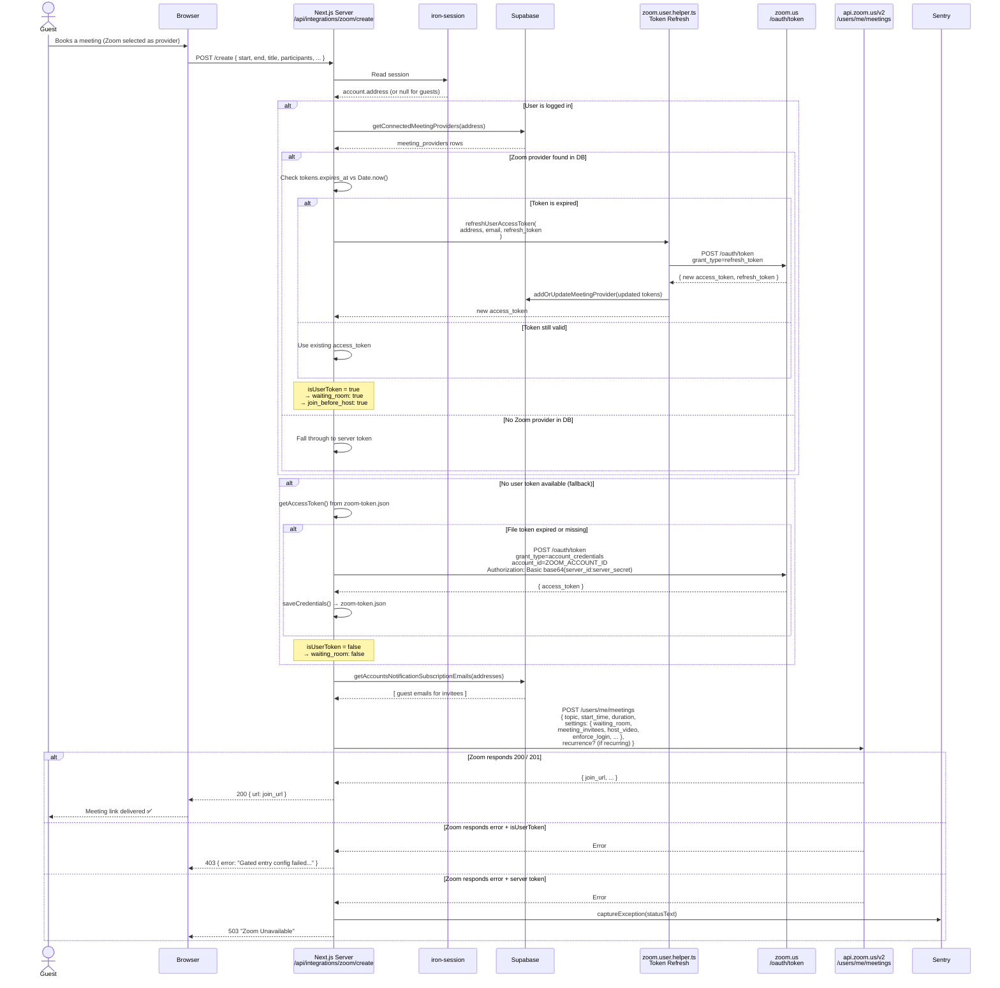
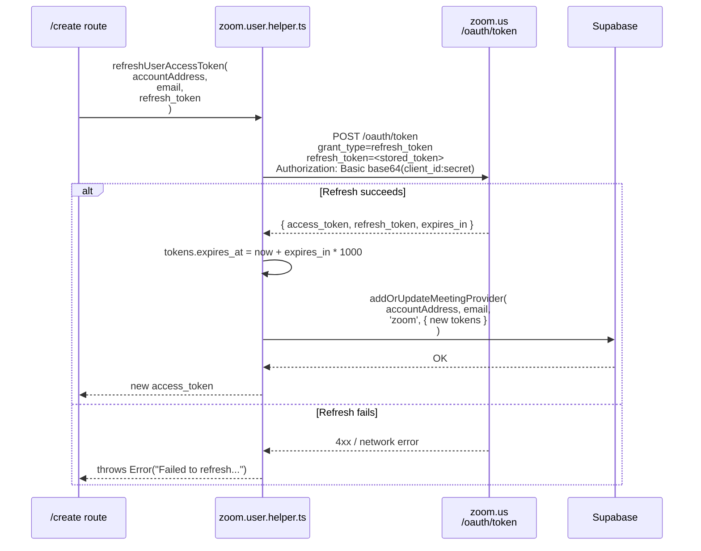
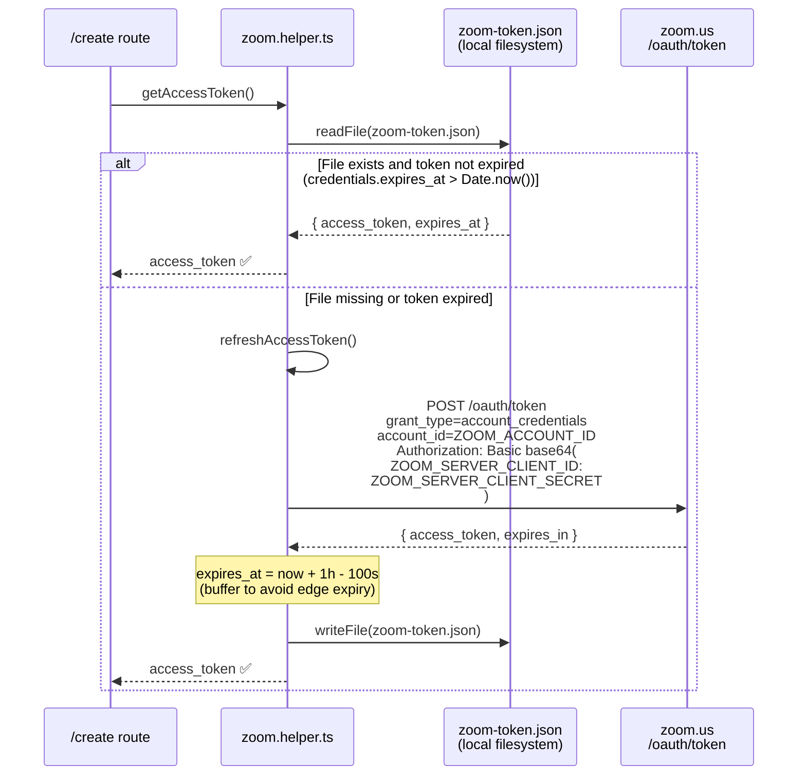
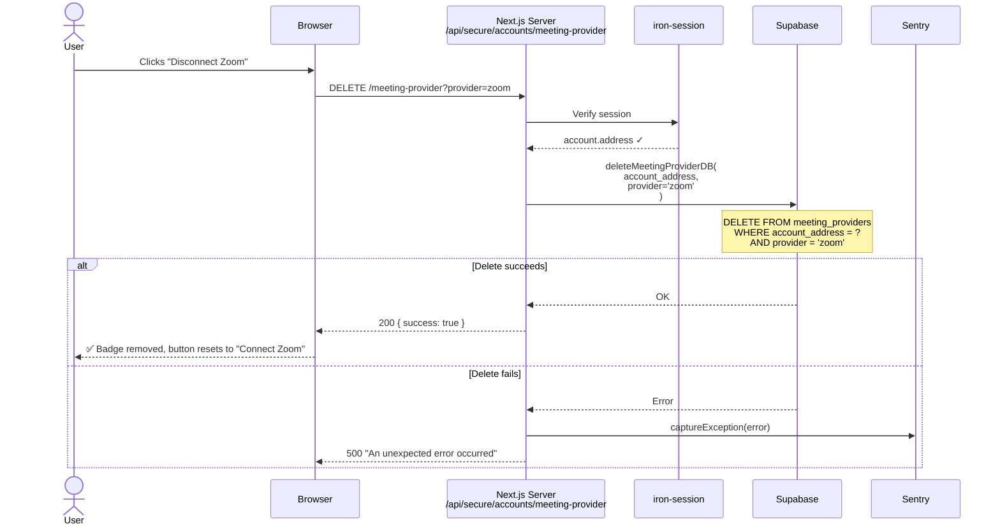
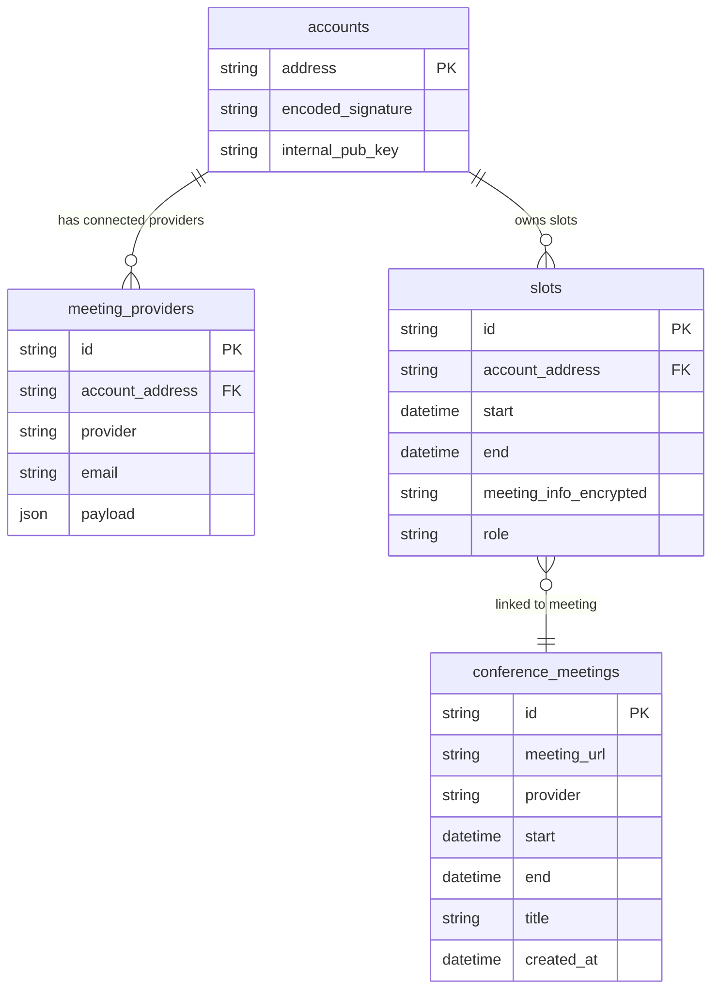
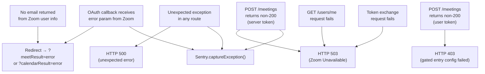

# Zoom Integration — Architecture & Flow Diagrams

This document covers every service that participates in the Zoom integration,
and provides detailed flow diagrams for each operation.

---

## 1. High-Level Architecture

All services that interact with Zoom, either directly or as supporting infrastructure.



---

## 2. Environment Variables & Credentials

Two separate Zoom app credentials are used, serving different purposes.



---

## 3. Flow: Connecting a Zoom Account (OAuth)

A user links their personal Zoom account to Meetwith. This enables private
meeting links and waiting rooms scoped to the user's own Zoom account.



---

## 4. Flow: Creating a Zoom Meeting

Called every time a meeting is booked through Meetwith. The server chooses
between two token strategies depending on whether the host has connected
their personal Zoom account.



---

## 5. Flow: Token Refresh (User OAuth)

The user's access token expires after ~1 hour. This refresh happens
automatically inside the meeting creation flow before calling the Zoom API.



---

## 6. Flow: Server-to-Server Token (Fallback)

Used when the meeting host has not connected a personal Zoom account.
Tokens are cached locally on the server filesystem to avoid redundant requests.



---

## 7. Flow: Disconnecting Zoom

The user removes the Zoom integration from their account.



---

## 8. Database Schema — Zoom-relevant Tables



The `meeting_providers.payload` column stores the full Zoom token object:

```json
{
  "access_token": "eyJ...",
  "refresh_token": "v1.MgA...",
  "token_type": "bearer",
  "expires_in": 3599,
  "expires_at": 1712345678000,
  "scope": "meeting:write user:read"
}
```

---

## 9. Zoom API Calls Summary

| Route              | Zoom Endpoint                      | Method | Auth                            |
| ------------------ | ---------------------------------- | ------ | ------------------------------- |
| `/callback`        | `zoom.us/oauth/token`              | POST   | Basic (client_id:secret)        |
| `/callback`        | `api.zoom.us/v2/users/me`          | GET    | Bearer user token               |
| `/create` (user)   | `zoom.us/oauth/token` (refresh)    | POST   | Basic (client_id:secret)        |
| `/create` (user)   | `api.zoom.us/v2/users/me/meetings` | POST   | Bearer user token               |
| `/create` (server) | `zoom.us/oauth/token` (s2s)        | POST   | Basic (server_id:server_secret) |
| `/create` (server) | `api.zoom.us/v2/users/me/meetings` | POST   | Bearer server token             |

---

## 10. Error Handling & Monitoring


